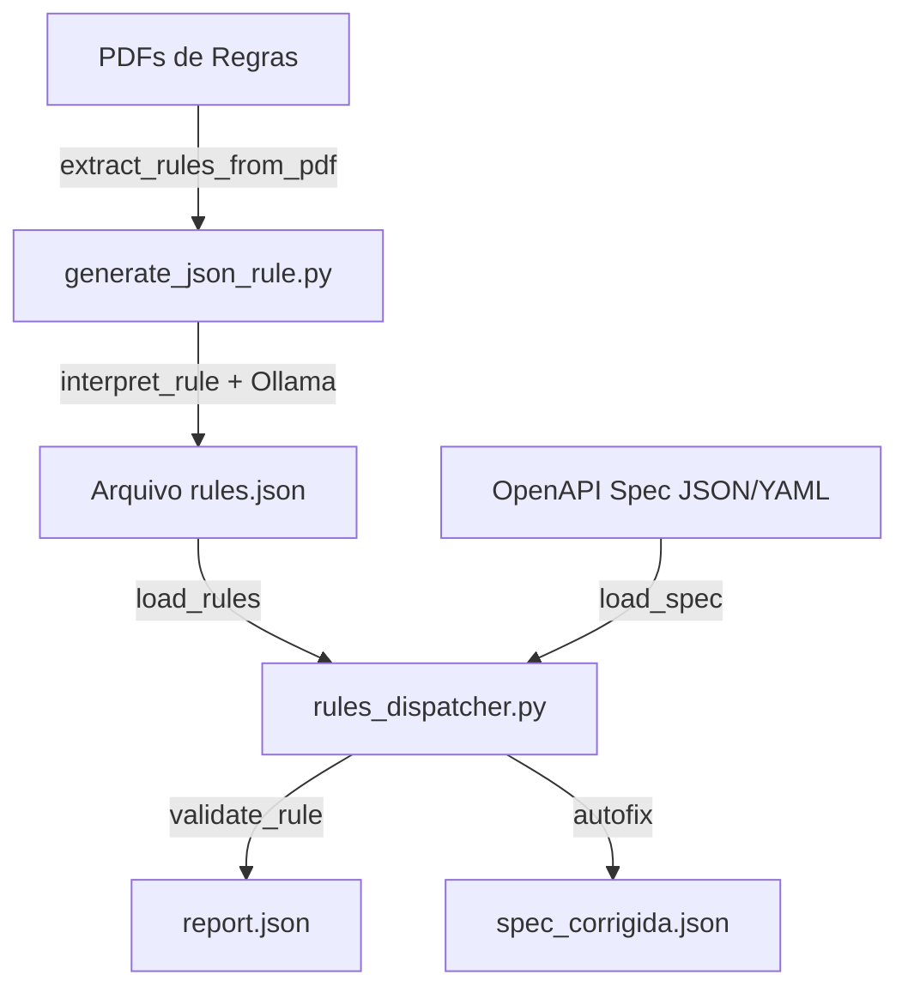

# 📘 Manual e Tutorial – Ferramenta de Validação OpenAPI

## 1. Introdução

Empresas que utilizam **APIs padronizadas (OpenAPI/Swagger)** enfrentam problemas comuns:

- Especificações inconsistentes entre times.  
- Endpoints com nomenclaturas divergentes (plural vs singular, camelCase vs snake_case).  
- Falta de campos obrigatórios (ex.: `200 response`, `description`).  
- Diferenças de versão entre **OAS2 (Swagger 2.0)** e **OAS3 (OpenAPI 3.x)**.  
- Regras de negócio documentadas em PDFs, mas difíceis de aplicar automaticamente.  

👉 A ferramenta resolve isso **validando e corrigindo automaticamente especificações OpenAPI** a partir de um conjunto de **regras atômicas** em JSON.  

Benefícios:
- Conformidade automática com regras internas de governança.  
- Correção automática com **autofix**.  
- Integração com **LLM (Ollama + LangChain)** para detectar inconsistências semânticas não cobertas por regras determinísticas.  

---

## 2. Tecnologias e Técnicas Utilizadas

- **Python 3** – base da aplicação.  
- **Ollama + LangChain** – processamento via modelo LLM (`mistral:instruct`).  
- **jsonpath_ng** – seleção de trechos específicos dentro da especificação.  
- **ruamel.yaml** – suporte a YAML (além de JSON).  
- **PyPDF2 + tqdm** – extração de regras de documentos PDF e processamento em lote.  
- **Arquitetura híbrida**:
  - **Execução determinística** → regras fixas aplicadas com JSONPath.  
  - **Execução via LLM** → detecção de inconsistências semânticas (plural, abreviações, nomes incoerentes).  

> **Nota:** Importante utilizar máquinas com GPU NVidia para obter mais poder de processamento, uma vez que os processos que utilizam a LLM requerem recursos extremos para execução.

---

## 3. Arquitetura da Solução



- **generate_json_rule.py** → lê PDFs, interpreta regras via LLM e gera `rules.json`.  
- **rules_dispatcher.py** → aplica regras sobre a especificação OpenAPI, gera relatório (`report.json`) e opcionalmente corrige a spec (`spec_corrigida.json`).  

---

## 4. Estrutura da Ferramenta

### Principais Componentes

1. **`generate_json_rule.py`**  
   - Extrai regras de documentos PDF.  
   - Interpreta cada regra usando LLM.  
   - Gera **rules.json**.  

2. **`rules_dispatcher.py`**  
   - Carrega **spec** (JSON/YAML).  
   - Carrega regras (`rules.json`).  
   - Aplica cada regra (determinística + LLM).  
   - Gera **relatório (report.json)** e **spec corrigida (spec_corrigida.json)**.  

---

## 5. Estrutura do JSON de Ações (rules.json)

Cada regra é um objeto JSON com os seguintes campos:

| Campo        | Descrição |
|--------------|-----------|
| **rule_code** | Código único da regra (ex: `R32`, `LLM01`). |
| **summary**   | Resumo do problema detectado. |
| **scope**     | Escopo da regra (`paths`, `parameters`, `schemas`, `responses`, `servers`). |
| **op**        | Operação a ser executada (`ensure`, `regex`, `unique`, `enum`, `length`, `update`, `uniform_all`). |
| **selector**  | Caminho JSONPath para encontrar o trecho da especificação. |
| **field**     | Campo alvo da validação ou modificação. |
| **value**     | Valor esperado ou sugerido (opcional, depende do `op`). |
| **pattern**   | Expressão regular usada para validação (quando `op=regex` ou `value_regex`). |
| **check_text**| Texto explicativo do problema. |
| **severity**  | Severidade (`info`, `warning`, `error`). |
| **autofix**   | Define se a regra pode ser corrigida automaticamente (`true`/`false`). |
| **hints**     | Dicas de boas práticas. |
| **oas_version** | Versão do OAS onde a regra se aplica (`oas2`, `oas3`, `null`). |

### Exemplo

```json
{
  "rule_code": "R32",
  "summary": "Responses devem conter 200",
  "scope": "responses",
  "op": "ensure",
  "selector": "$.paths.*.*.responses",
  "field": "200",
  "check_text": "Todas as operações devem ter response 200",
  "severity": "error",
  "autofix": true,
  "hints": ["Adicione responses.200 com description"],
  "oas_version": "oas3"
}
```

---


## 6. Tipos de Operações de Regras

Cada regra em `rules.json` possui um campo **op** que define como a validação ou correção deve ser aplicada.  
Abaixo estão os principais tipos suportados pela ferramenta:

---

## ✅ ensure
- **Objetivo:** Garantir que um campo exista na especificação.  
- **Exemplo:** toda resposta deve ter o código `200`.  
- **Configuração típica:**
```json
{
  "op": "ensure",
  "selector": "$.paths.*.*.responses",
  "field": "200",
  "check_text": "Responses devem conter 200"
}
```

---

## 🔤 regex
- **Objetivo:** Validar formato de nomes de atributos, parâmetros ou chaves.  
- **Exemplo:** parâmetros devem estar em `lowerCamelCase`.  
- **Configuração típica:**
```json
{
  "op": "regex",
  "selector": "$.paths.*.*.parameters[*].name",
  "field": "name",
  "pattern": "^[a-z][a-zA-Z0-9]*$",
  "check_text": "Parâmetros devem seguir lowerCamelCase"
}
```

---

## 🔗 value_regex
- **Objetivo:** Validar conteúdo de valores string (URLs, padrões textuais).  
- **Exemplo:** URLs de servidores devem começar com `http://Caminho_backend/`.  
- **Configuração típica:**
```json
{
  "op": "value_regex",
  "selector": "$.servers[*].url",
  "field": "url",
  "pattern": "^http://Caminho_backend/.*$",
  "value": "http://Caminho_backend/api/fees/v2",
  "check_text": "URL deve iniciar com http://Caminho_backend/"
}
```

---

## 🎯 enum
- **Objetivo:** Restringir valores a um conjunto fixo permitido.  
- **Exemplo:** tipos de dados devem ser `string`, `integer`, `boolean`, `number`.  
- **Configuração típica:**
```json
{
  "op": "enum",
  "selector": "$.components.schemas.*.properties.*",
  "field": "type",
  "value": ["string", "integer", "boolean", "number"],
  "check_text": "Tipos devem estar no conjunto permitido"
}
```

---

## 📏 length
- **Objetivo:** Validar comprimento de strings.  
- **Exemplo:** CPF deve ter exatamente 11 caracteres.  
- **Configuração típica:**
```json
{
  "op": "length",
  "selector": "$.components.schemas.*.properties",
  "field": "*cpf*",
  "value": {"min": 11, "max": 11},
  "check_text": "CPF deve ter 11 caracteres"
}
```

---

## 🔄 update
- **Objetivo:** Atualizar nomes de chaves ou valores.  
- **Exemplo:** trocar `/investment-fund` por `/investment-funds`.  
- **Configuração típica:**
```json
{
  "op": "update",
  "selector": "$.paths",
  "field": "/investment-fund",
  "value": "/investment-funds",
  "check_text": "Endpoints devem estar no plural"
}
```

---

## 🔁 uniform_all
- **Objetivo:** Garantir consistência de definição para campos repetidos em diferentes locais.  
- **Exemplo:** `managerDocumentNumber` deve ter sempre `{type=string, maxLength=14}`.  
- **Configuração típica:**
```json
{
  "op": "uniform_all",
  "selector": "$.components.schemas.*.properties",
  "field": "*",
  "check_text": "Campos iguais devem ter atributos consistentes"
}
```

---

## 🚨 unique
- **Objetivo:** Garantir que valores não sejam duplicados.  
- **Exemplo:** `operationId` deve ser único em todas as operações.  
- **Configuração típica:**
```json
{
  "op": "unique",
  "selector": "$.paths.*.*",
  "field": "operationId",
  "check_text": "Cada operação deve ter operationId único"
}
```

---

## 7. Execução Determinística x Execução via LLM

### Determinística
- Baseada em regras **fixas e previsíveis** (regex, ensure, enum, etc.).  
- Ideal para validações técnicas e estruturais.  
- **Exemplo:** garantir que todo parâmetro siga `lowerCamelCase`.

### LLM (LangChain + Ollama)
- Detecta **inconsistências semânticas** não cobertas por regras fixas.  
- Exemplo: detectar se `/investment-fund` deveria ser `/investment-funds`.  
- Gera novas regras dinâmicas (`LLMxx`) que são adicionadas ao pipeline.  

👉 O modelo híbrido garante **precisão técnica** e **cobertura semântica**.  

---

## 8. Como Executar

### 1) Gerar regras a partir de PDF
```bash
python generate_json_rule.py regras.pdf spec_base.json rules.json
```

- `regras.pdf` → documento de regras.  
- `spec_base.json` → especificação OpenAPI base.  
- `rules.json` → arquivo de saída contendo as regras.  

---

### 2) Rodar o validador
```bash
python rules_dispatcher.py spec.json rules.json --min-severity warning
```

Parâmetros:
- **spec.json|yaml** → especificação OpenAPI a validar.  
- **rules.json** → regras geradas (determinísticas + LLM).  
- **--min-severity** → nível mínimo de severidade a considerar (`info`, `warning`, `error`).  

Saídas:
- `report.json` → relatório de problemas encontrados.  
- `spec_corrigida.json` → especificação corrigida (se `autofix` ativado).  

---

## 8. Exemplos de Uso

### Exemplo 1 – Detectar parâmetros em `lowerCamelCase`
```json
{
  "rule_code": "R52",
  "summary": "Parâmetros em lowerCamelCase",
  "scope": "parameters",
  "op": "regex",
  "selector": "$.paths.*.*.parameters[*].name",
  "pattern": "^[a-z][a-zA-Z0-9]*$",
  "field": "name",
  "check_text": "Parâmetros devem seguir lowerCamelCase",
  "severity": "warning",
  "autofix": true,
  "hints": ["Exemplo: investmentFundName"],
  "oas_version": null
}
```

### Exemplo 2 – Atualização sugerida por LLM
```json
{
  "rule_code": "LLM01",
  "summary": "Endpoints devem estar no plural",
  "scope": "paths",
  "op": "update",
  "selector": "$.paths",
  "field": "/investment-fund",
  "value": "/investment-funds",
  "check_text": "Endpoints devem estar no plural",
  "severity": "warning",
  "autofix": true,
  "hints": ["Use nomes de recursos sempre no plural"],
  "oas_version": null
}
```

---

# ✅ Conclusão

Este manual cobre:

- O **problema de negócio** que a ferramenta resolve.  
- **Arquitetura** híbrida com regras determinísticas e suporte a LLM.  
- **Componentes** (`generate_json_rule.py` e `rules_dispatcher.py`).  
- **Estrutura do JSON** de ações e exemplos.  
- Como **executar passo a passo** e interpretar os resultados.  

👉 Assim você consegue automatizar a validação e correção de especificações OpenAPI de forma padronizada, com governança e flexibilidade.

## Acknowledgments

- **Author** - Cristiano Hoshikawa (Oracle LAD A-Team Solution Engineer)