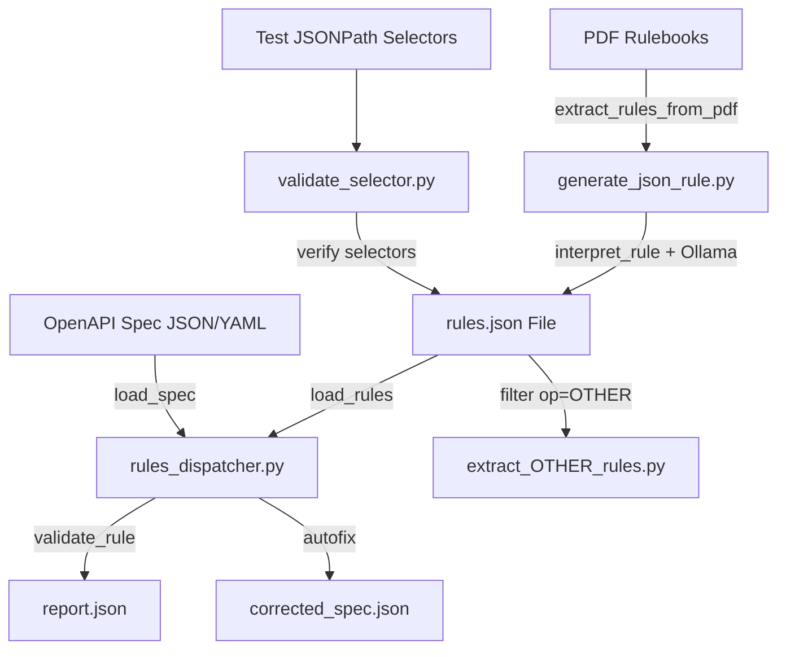

# 📘 Manual and Tutorial – OpenAPI Validation Tool

## 1. Introduction

Companies that use **standardized APIs (OpenAPI/Swagger)** face common problems:

- Inconsistent specifications across teams.  
- Endpoints with divergent naming conventions (plural vs singular, camelCase vs snake_case).  
- Missing mandatory fields (e.g., `200 response`, `description`).  
- Version differences between **OAS2 (Swagger 2.0)** and **OAS3 (OpenAPI 3.x)**.  
- Business rules documented in PDFs but difficult to apply automatically.  

👉 This tool solves this by **validating and automatically correcting OpenAPI specifications** based on a set of **atomic rules** in JSON.  

Benefits:
- Automatic compliance with internal governance rules.  
- Automatic correction with **autofix**.  
- Integration with **LLM (Ollama + LangChain)** to detect semantic inconsistencies not covered by deterministic rules.  

---

## 2. Technologies and Techniques Used

- **Python 3** – application base.  
- **Ollama + LangChain** – processing via LLM model (`mistral:instruct`).  
- **jsonpath_ng** – selecting specific parts of the specification.  
- **ruamel.yaml** – YAML support (in addition to JSON).  
- **PyPDF2 + tqdm** – extracting rules from PDF documents and batch processing.  
- **Hybrid architecture**:
  - **Deterministic execution** → fixed rules applied with JSONPath.  
  - **LLM execution** → detection of semantic inconsistencies (plural, abbreviations, incoherent names).  

> **Note:** It is important to use machines with NVidia GPUs for more processing power, as LLM processes require significant computational resources.

---

## 3. Solution Architecture



- **generate_json_rule.py** → reads PDFs, interprets rules via LLM, and generates `rules.json`.  
- **rules_dispatcher.py** → applies rules on the OpenAPI specification, generates a report (`report.json`), and optionally corrects the spec (`corrected_spec.json`).  

---

## 4. Tool Structure

### Main Components

1. **`generate_json_rule.py`**  
   - Extracts rules from PDF documents.  
   - Interprets each rule using LLM.  
   - Generates **rules.json**.  

> **Note:** generate_json_rule.py creates a formated JSON rule files with operations that can be executed on the rules_dispatcher.py code. The LLM will convert textual descriptions on the PDF file into a JSON action and could be not very precise, so you need to analyze each generated action before apply to your rules file. Pain attention to OTHER actions rules generated, because the LLM didn't find the  correct operation, so it probably needs to develop a specific LLM interpreting process.

> **Note 2:** The benefit of using the generate_json_rule.py tool is: 90% of a description from the PDF file is converted into a formatted JSON rule.

2. **`rules_dispatcher.py`**  
   - Loads **spec** (JSON/YAML).  
   - Loads rules (`rules.json`).  
   - Applies each rule (deterministic + LLM).  
   - Generates **report (report.json)** and **corrected spec (corrected_spec.json)**.  

3. **`validate_selector.py`**  
   - Tests and validates JSONPath selectors used in rules.  
   - Ensures that selectors correctly locate fields in the OpenAPI specification.  
   - Example:  
     ```bash
     python validate_selector.py spec.json rules.json [--only_errors]
     
     spec.json: your OAS specification
     rules.json: your JSON rules to be tested
     --only_errors: inform just selectors with errors 
     ```

4. **`extract_OTHER_rules.py`**  
   - Identifies rules with `op=OTHER`.  
   - Helps refine ambiguous rules not mapped to deterministic operations.  
   - Example:  
     ```bash
     python extract_OTHER_rules.py rules.json output.json

     rules.json: your JSON rules to be tested
     output.json: the JSON file with OTHER operations
    ```

---

## 5. Actions JSON Structure (rules.json)

Each rule is a JSON object with the following fields:

| Field        | Description |
|--------------|-------------|
| **rule_code** | Unique rule code (e.g., `R32`, `LLM01`). |
| **summary**   | Summary of the detected issue. |
| **scope**     | Scope of the rule (`paths`, `parameters`, `schemas`, `responses`, `servers`). |
| **op**        | Operation to be executed (`ensure`, `regex`, `unique`, `enum`, `length`, `update`, `uniform_all`). |
| **selector**  | JSONPath expression to find the specification section. |
| **field**     | Target field for validation or modification. |
| **value**     | Expected or suggested value (optional, depends on `op`). |
| **pattern**   | Regular expression used for validation (when `op=regex` or `value_regex`). |
| **check_text**| Explanatory text of the issue. |
| **severity**  | Severity (`info`, `warning`, `error`). |
| **autofix**   | Defines whether the rule can be automatically fixed (`true`/`false`). |
| **hints**     | Best practice hints. |
| **oas_version** | OAS version where the rule applies (`oas2`, `oas3`, `null`). |

### Example

```json
{
  "rule_code": "R32",
  "summary": "Responses must contain 200",
  "scope": "responses",
  "op": "ensure",
  "selector": "$.paths.*.*.responses",
  "field": "200",
  "check_text": "All operations must have response 200",
  "severity": "error",
  "autofix": true,
  "hints": ["Add responses.200 with description"],
  "oas_version": "oas3"
}
```

---

## 6. Types of Rule Operations

Each rule in `rules.json` has a field **op** that defines how validation or correction should be applied.  
Below are the main types supported by the tool:

---

## ✅ ensure
- **Objective:** Ensure that a field exists in the specification.  
- **Example:** every response must have code `200`.  
- **Typical configuration:**
```json
{
  "op": "ensure",
  "selector": "$.paths.*.*.responses",
  "field": "200",
  "check_text": "Responses must contain 200"
}
```

---

## 🔤 regex
- **Objective:** Validate the format of attribute, parameter, or key names.  
- **Example:** parameters must be in `lowerCamelCase`.  
- **Typical configuration:**
```json
{
  "op": "regex",
  "selector": "$.paths.*.*.parameters[*].name",
  "field": "name",
  "pattern": "^[a-z][a-zA-Z0-9]*$",
  "check_text": "Parameters must follow lowerCamelCase"
}
```

---

## 🔗 value_regex
- **Objective:** Validate the content of string values (URLs, textual patterns).  
- **Example:** server URLs must start with `http://Backend_path/`.  
- **Typical configuration:**
```json
{
  "op": "value_regex",
  "selector": "$.servers[*].url",
  "field": "url",
  "pattern": "^http://Backend_path/.*$",
  "value": "http://Backend_path/api/fees/v2",
  "check_text": "URL must start with http://Backend_path/"
}
```

---

## 🎯 enum
- **Objective:** Restrict values to a fixed allowed set.  
- **Example:** data types must be `string`, `integer`, `boolean`, `number`.  
- **Typical configuration:**
```json
{
  "op": "enum",
  "selector": "$.components.schemas.*.properties.*",
  "field": "type",
  "value": ["string", "integer", "boolean", "number"],
  "check_text": "Types must be within the allowed set"
}
```

---

## 📏 length
- **Objective:** Validate string length.  
- **Example:** CPF must have exactly 11 characters.  
- **Typical configuration:**
```json
{
  "op": "length",
  "selector": "$.components.schemas.*.properties",
  "field": "*cpf*",
  "value": {"min": 11, "max": 11},
  "check_text": "CPF must have 11 characters"
}
```

---

## 🔄 update
- **Objective:** Update key names or values.  
- **Example:** replace `/investment-fund` with `/investment-funds`.  
- **Typical configuration:**
```json
{
  "op": "update",
  "selector": "$.paths",
  "field": "/investment-fund",
  "value": "/investment-funds",
  "check_text": "Endpoints must be plural"
}
```

---

## 🔁 uniform_all
- **Objective:** Ensure consistency of definitions for fields repeated in different places.  
- **Example:** `managerDocumentNumber` must always be `{type=string, maxLength=14}`.  
- **Typical configuration:**
```json
{
  "op": "uniform_all",
  "selector": "$.components.schemas.*.properties",
  "field": "*",
  "check_text": "Identical fields must have consistent attributes"
}
```

---

## 🚨 unique
- **Objective:** Ensure values are not duplicated.  
- **Example:** `operationId` must be unique across all operations.  
- **Typical configuration:**
```json
{
  "op": "unique",
  "selector": "$.paths.*.*",
  "field": "operationId",
  "check_text": "Each operation must have a unique operationId"
}
```

---

## 7. Deterministic Execution vs LLM Execution

### Deterministic
- Based on **fixed and predictable** rules (regex, ensure, enum, etc.).  
- Ideal for technical and structural validations.  
- **Example:** ensure every parameter follows `lowerCamelCase`.

### LLM (LangChain + Ollama)
- Detects **semantic inconsistencies** not covered by fixed rules.  
- Example: detect if `/investment-fund` should be `/investment-funds`.  
- Generates new dynamic rules (`LLMxx`) that are added to the pipeline.  

👉 The hybrid model ensures **technical precision** and **semantic coverage**.  

## 8. Why LLM is Needed for Semantic Rules (Plural Example)

Deterministic approaches (like JSONPath, regex, enum) are **excellent for structural validations** (e.g., checking if a field exists, ensuring camelCase, verifying maxLength).

However, some problems are **semantic**, not structural. For example:

- A path `/investment-fund` should ideally be `/investment-funds`.
- Regex or JSONPath **cannot know** whether a resource name should be singular or plural.
- Business context dictates this: endpoints typically represent **collections of resources** (plural).

👉 This is why **LLM-based rules are required**. They can **interpret natural language and semantic context** to suggest corrections that deterministic code cannot handle.

### Example Rule (LLM Plural)

```json
{
  "rule_code": "LLM01",
  "summary": "Endpoints must be plural",
  "scope": "paths",
  "op": "update",
  "selector": "$.paths",
  "field": "/investment-fund",
  "value": "/investment-funds",
  "check_text": "Endpoints must be plural",
  "severity": "warning",
  "autofix": true,
  "hints": ["Always use resource names in plural"],
  "oas_version": null
}
```

### Why Deterministic Code Fails Here

- **Regex**: Can only match patterns (e.g., lowercase letters, underscores). It **cannot decide** if a word is plural or singular.
- **Enum/Ensure**: Can check against fixed sets, but we cannot predefine **all valid plural forms** (funds, accounts, customers).
- **JSONPath**: Can locate fields but not decide if naming is correct.

Thus, a **deterministic-only validator cannot enforce plural rules**.

### LLM Prompt Example

The validator sends the **spec** and the **atomic rule** to the LLM with a deterministic instruction:

```text
RETURN **only** the OpenAPI SPECIFICATION in JSON, already corrected according to the received rule.  
If the rule does not apply or there is ambiguity, RETURN **exactly** the unchanged spec_json.  
DO NOT include markdown, comments, helper keys, or diffs.  

You will receive:
- ONE atomic rule in JSON (rule_json)
- ONE OpenAPI specification in JSON (spec_json)

Your task:
1) **Interpret** rule_json, including semantic hints such as plural vs singular.  
2) **Inspect** spec_json to find endpoints not aligned with plural naming.  
3) **Apply** the correction by updating singular endpoints to plural.  
```

### Dispatcher Code Comment

```python
if rule["rule_code"].startswith("LLM"):
    # 🚀 Semantic case: requires LLM interpretation
    # Example: Plural vs singular in endpoints (/investment-fund → /investment-funds)
    # Deterministic code cannot infer semantic correctness of words,
    # so we forward the spec and rule_json to the LLM prompt engine.
    corrected_spec = call_llm_with_rule(rule, spec)
else:
    # ✅ Deterministic case: handled by regex/ensure/enum/length
    corrected_spec = apply_deterministic_rule(rule, spec)
```

👉 With this approach, **deterministic rules** guarantee structural integrity, while **LLM rules** handle semantic corrections, making the validator complete and hybrid.

---

## 9. How to Run

### 1) Generate rules from PDF
```bash
python generate_json_rule.py rules.pdf spec_base.json rules.json
```

- `rules.pdf` → rules document.  
- `spec_base.json` → base OpenAPI specification.  
- `rules.json` → output file containing rules.  

---

### 2) Run the validator
```bash
python rules_dispatcher.py spec.json rules.json --min-severity warning
```

Parameters:
- **spec.json|yaml** → OpenAPI specification to validate.  
- **rules.json** → generated rules (deterministic + LLM).  
- **--min-severity** → minimum severity level to consider (`info`, `warning`, `error`).  

Outputs:
- `report.json` → report of identified issues.  
- `corrected_spec.json` → corrected specification (if `autofix` enabled).  

---

## 10. Usage Examples

### Example 1 – Detect parameters in `lowerCamelCase`
```json
{
  "rule_code": "R52",
  "summary": "Parameters in lowerCamelCase",
  "scope": "parameters",
  "op": "regex",
  "selector": "$.paths.*.*.parameters[*].name",
  "pattern": "^[a-z][a-zA-Z0-9]*$",
  "field": "name",
  "check_text": "Parameters must follow lowerCamelCase",
  "severity": "warning",
  "autofix": true,
  "hints": ["Example: investmentFundName"],
  "oas_version": null
}
```

### Example 2 – LLM-suggested update
```json
{
  "rule_code": "LLM01",
  "summary": "Endpoints must be plural",
  "scope": "paths",
  "op": "update",
  "selector": "$.paths",
  "field": "/investment-fund",
  "value": "/investment-funds",
  "check_text": "Endpoints must be plural",
  "severity": "warning",
  "autofix": true,
  "hints": ["Always use resource names in plural"],
  "oas_version": null
}
```

---

## 11. Additional Procedures and Tools

Beyond the main workflow, two supporting tools are included to improve rule extraction and validation:

### **`validate_selector.py`**
- Purpose: Tests and validates JSONPath selectors used inside the rules.  
- Ensures selectors are correct before applying rules.  

### **`extract_OTHER_rules.py`**
- Purpose: Identifies rules with operation `OTHER`.  
- Helps refine rules not yet classified into deterministic operations.  

---

# ✅ Conclusion

This manual covers:

- The **business problem** the tool solves.  
- **Hybrid architecture** with deterministic rules and LLM support.  
- **Components** (`generate_json_rule.py` and `rules_dispatcher.py`).  
- **JSON structure** of actions and examples.  
- How to **run step by step** and interpret results.  

👉 This way, you can automate the validation and correction of OpenAPI specifications in a standardized way, with governance and flexibility.

## Acknowledgments

- **Author** - Cristiano Hoshikawa (Oracle LAD A-Team Solution Engineer)
